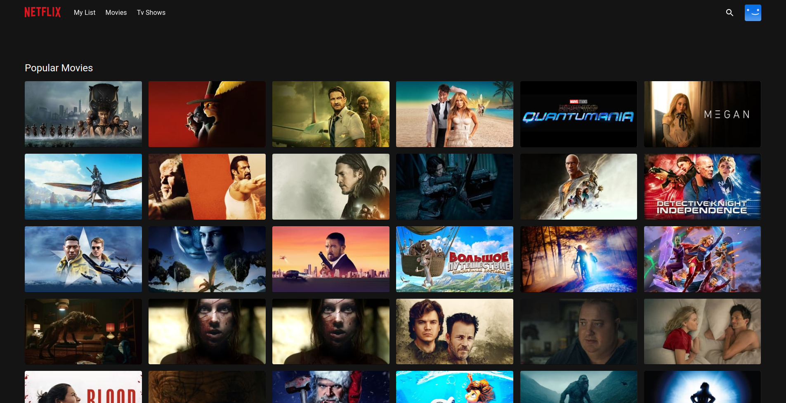

<details>
  <summary>Table of Contents</summary>
  <ol>
    <li>
      <a href="#prerequests">Prerequests</a>
    </li>
    <li>
      <a href="#which-features-this-project-deals-with">Which features this project deals with</a>
    </li>
    <li><a href="#third-party-libraries-used-except-for-react-and-rtk">Third Party libraries used except for React and RTK</a></li>
    <li>
      <a href="#contact">Contact</a>
    </li>
  </ol>
</details>

<br />

<div align="center">
  
  <p align="center">Home Page</p>
  
  <p align="center">Mini Portal</p>
  
  <p align="center">Detail Modal</p>
  
  <p align="center">Grid Genre Page</p>
  
  <p align="center">Watch Page with customer contol bar</p>
</div>

## Prerequests

- Create an account if you don't have on [TMDB](https://www.themoviedb.org/).
  Because I use its free API to consume movie/tv data.
- And then follow the [documentation](https://developers.themoviedb.org/3/getting-started/introduction) to create API Key
- Finally, if you use v3 of TMDB API, create a file named `.env`, and copy and paste the content of `.env.example`.
  And then paste the API Key you just created.


## Install with Docker

```sh
docker build --build-arg TMDB_V3_API_KEY=your_api_key_here -t netflix-clone .

docker run --name netflix-clone-website --rm -d -p 80:80 netflix-clone

docker tag netflix-clone:latest your_docker_hub_username/netflix-clone:latest

docker push your_docker_hub_username/netflix-clone:latest
```

## Todo

- Make the animation of video card portal more similar to Netflix.
- Improve performance. I am using `context` and `provider` but all components subscribed to the context's value are re-rendered. These re-renders happen even if the part of the value is not used in render of the component. there are [several ways](https://blog.axlight.com/posts/4-options-to-prevent-extra-rerenders-with-react-context/) to prevent the re-renders from these behaviours. In addition to them, there may be several performance issues.
- Replace bundler([Vite](https://vitejs.dev/guide)) with [Turbopack](https://turbo.build/pack/docs/why-turbopack). Turbopack is introduced in Next.js conf recently. It's very fast but it's nor ready to use right now. it just support Next.js, and they plan to support all others as soon as possible. so if it's ready to use, replace [Vite](https://vitejs.dev/guide) with [Turbopack](https://turbo.build/pack/docs/why-turbopack).
- Add accessibilities for better UX.
- Add Tests.

## Pull Request 

- Create a new branch and push your changes to it. 
- Create a pull request to `main` branch. 
- Add a description of your changes.
- Add a screenshot of your changes. 
- Add a link to the deployed version of your changes.
- Add a link to the issue you are solving.
- Add a link to the documentation of the issue you are solving.

## Happy Coding! 🚀 